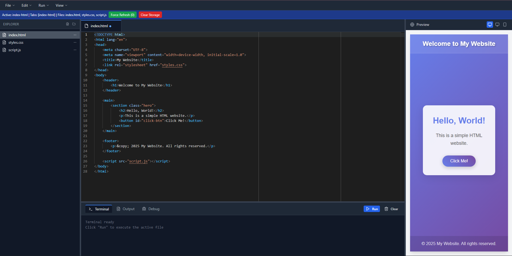
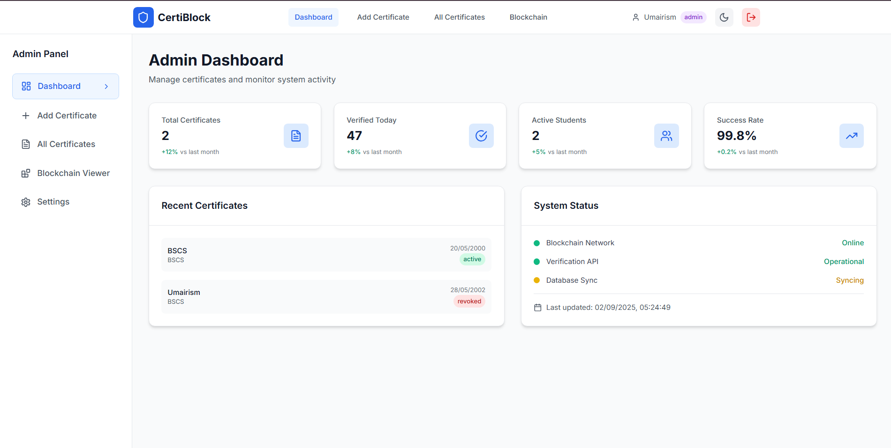
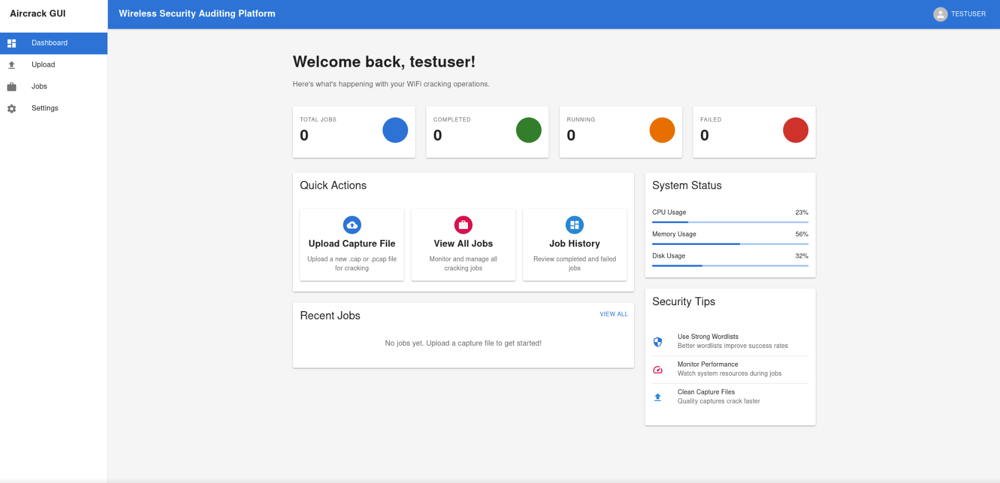
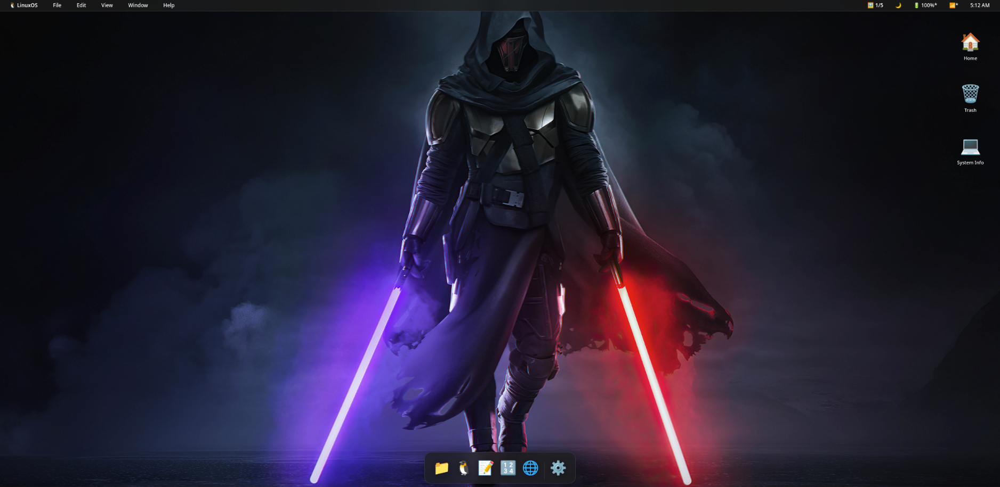

# Portfolio Website

[](https://umairhakeem.netlify.app)
[](https://reactjs.org/)
[](LICENSE)

> Full-stack engineer building production-ready solutions across web, blockchain, AI/ML, and cybersecurity.

**[🚀 View Portfolio](https://umairhakeem.netlify.app)** • **[💼 LinkedIn](https://www.linkedin.com/in/umairsim/)** • **[📧 Contact](mailto:malikumairhakim@outlook.com)**

---

## 🎯 Quick Links

**Featured Work** → [CodeSpace](#codespace) • [HealSense](#healsense) • [Blockchain Certs](#blockchain-certs) • [PenTest Framework](#pentest)

**Tech Stack** → React • TypeScript • Python • Node.js • Ethereum • TensorFlow • Docker

---

## 🚀 Featured Projects

<div id="codespace"></div>

### 🖥️ [CodeSpace](https://github.com/Umairism/codespace) • [Live Demo](https://webcodespace.netlify.app)
**Zero-setup browser IDE with Monaco Editor and real-time Python execution.**  
*Like VSCode but runs entirely client-side—no servers, instant dev environment.*



---

<div id="healsense"></div>

### 🏥 [HealSense](https://github.com/Umairism/FYP-Project)
**IoT health surveillance with TensorFlow predictions on Raspberry Pi clusters.**  
*Final Year Project: ML-powered vitals monitoring with Flutter mobile dashboard.*

---

<div id="blockchain-certs"></div>

### 🔐 [Blockchain Certificate Verification](https://github.com/Umairism/blockchain-cert-system)
**Ethereum-backed credential verification with AI fraud detection (FAISS + OCR).**  
*Tamper-proof diplomas stored on-chain with MetaMask integration.*



---

<div id="pentest"></div>

### 🛡️ [Advanced PenTest Framework](https://github.com/Umairism/advanced-pentest-framework)
**Professional security toolkit—network scanning, payload generation, vulnerability reports.**  
*Python-based framework with GUI for ethical hacking and CTF challenges.*



---

### 📰 [The Chronicle](https://github.com/Umairism/The-Chronicle)
**News aggregation + CMS with Supabase backend and multi-source feeds.**

### 🖱️ [LinuxOS Desktop](https://github.com/umairism/linuxos-desktop) • [Live](https://linuxos.netlify.app)
**macOS-inspired web desktop with functional apps—browser, terminal, calculator.**



---

## 💼 More Projects

<details>
<summary><b>Web Development (8 projects)</b></summary>

- **[ModernShop E-Commerce](https://github.com/Umairism/e-commerce)** • [Demo](https://myecoms.netlify.app) — Serverless shopping cart with Netlify Functions
- **[WeddingShare](https://github.com/Umairism/WeddingShare)** • [Demo](https://wedding-share-vert.vercel.app) — Next.js event media upload with JWT auth
- **[SlimeTube](https://github.com/Umairism/SlimeTube)** • [Demo](https://flixii.netlify.app/) — Video streaming platform with IndexedDB persistence
- **Taskify, TaskMaster, Postit** — Task management apps with varied tech stacks

</details>

<details>
<summary><b>Cybersecurity (3 projects)</b></summary>

- **[Aircrack-NG GUI](https://github.com/Umairism/Aircrack_GUI)** — Web interface for wireless security auditing with FastAPI backend
- **DDoS Simulator** — Educational tool for understanding network attacks

</details>

<details>
<summary><b>AI & ML (3 projects)</b></summary>

- **[Portable AI Agent](https://github.com/Umairism/Porable-Ai-Agent)** — Offline-capable AI with PyTorch, privacy-first design
- **[Surveillance Drone](https://github.com/Umairism/Drone-System)** — Computer vision + DroneKit for autonomous flight paths

</details>

<details>
<summary><b>Business & Enterprise (5 projects)</b></summary>

- **[Office Management System](https://github.com/Umairism/OfficeManagementSystem)** — ASP.NET employee management with N-tier architecture
- **Medical Store Management** — Healthcare inventory with comprehensive reporting
- **Benchmark School System** — Educational platform with analytics
- **Teachers Club** — Course management and student tracking

</details>

**[📂 View All 37+ Projects](https://umairhakeem.netlify.app)**

---

## 🛠️ Tech Stack

```typescript
{
  frontend: ["React", "TypeScript", "Next.js", "Tailwind CSS", "Three.js"],
  backend: ["Node.js", "Python", "Flask", "FastAPI", ".NET"],
  databases: ["MongoDB", "PostgreSQL", "Supabase", "SQL Server"],
  blockchain: ["Ethereum", "Solidity", "Web3", "IPFS"],
  aiml: ["TensorFlow", "PyTorch", "OpenCV", "FAISS"],
  iot: ["Arduino", "Raspberry Pi", "DroneKit"],
  mobile: ["React Native", "Flutter"],
  devops: ["Docker", "Kubernetes", "GitHub Actions", "Prometheus"],
  deployment: ["Netlify", "Vercel"]
}
```

---

## 🚀 Quick Start

```bash
# Clone the repo
git clone https://github.com/Umairism/Portfolio.git
cd Portfolio

# Install dependencies
npm install

# Start dev server (http://localhost:3000)
npm start

# Build for production
npm run build
```

**Requirements:** Node.js 16+

---

## 📈 Performance

- ⚡ Lighthouse score: **95+** across all metrics
- 🌐 Mobile-responsive with sub-2s load times on 3G
- ♿ WCAG accessibility compliant

---

## 📝 Important Notes

### 🏷️ **GitHub Topics**
To improve discoverability, add these topics to your repository:
```
portfolio, react, typescript, fullstack, nodejs, python, blockchain, 
ai-ml, iot, cybersecurity, web-development, developer-portfolio
```
*Go to: Repository Settings → Topics → Add topics*

### 📸 **Project Screenshots**
Each project repo should include:
- Hero screenshot in README (use real screenshots, not placeholders)
- Live demo badge
- Tech stack badges

**Example:**
```markdown

[](https://your-demo.com)
```

---

## 📞 Contact

**Available for freelance & full-time roles** in full-stack development, blockchain, and AI/ML.

📧 [malikumairhakim@outlook.com](mailto:malikumairhakim@outlook.com)  
💼 [LinkedIn](https://www.linkedin.com/in/umairsim/)  
🐙 [GitHub](https://github.com/Umairism)

---

## 📄 License

MIT License - see [LICENSE](LICENSE) for details.

---

<div align="center">

**⭐ Star this repo if you found it helpful!**

*Made with ❤️ by [Umair Hakim](https://umairhakeem.netlify.app)*

</div>
